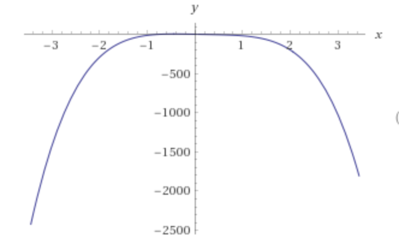

# Linear regression example



This project trains a single fully-connected layer to fit a 4th degree polynomial. This is a porting of [pytorch/examples/regression](https://github.com/pytorch/examples/tree/master/regression) making it usables on [FloydHub](https://www.floydhub.com/).

## Usage

Training and Evaluating script:

```bash
usage: main.py [-h] [--seed S] [--outf OUTF] [--ckpf CKPF] [--degree P]
               [--batch-size N] [--train] [--evaluate]

Pytorch Linear Regression

optional arguments:
  -h, --help      show this help message and exit
  --seed S        random seed (default: 1)
  --outf OUTF     folder to output images and model checkpoints
  --ckpf CKPF     path to model checkpoint file (to continue training)
  --degree P      polynomial degree to learn(default: 4)
  --batch-size N  input batch size for training (default: 32)
  --train         training a fully connected layer
  --evaluate      Evaluate a [pre]trained model from a random tensor.
```

## Linear Regression Architecture


## Run on FloydHub

Here's the commands to training, evaluating and serving your regression model on [FloydHub](ttps://www.floydhub.com/).

### Project Setup

Before you start, log in on FloydHub with the [floyd login](http://docs.floydhub.com/commands/login/) command, then fork and init
the project:

```bash
$ git clone https://github.com/ReDeiPirati/regression.git
$ cd regression
$ floyd init regression
```

### Training

This project will automatically create a dataset from a normal distribution with zero mean and variance one for you(from the generated number will create a sample with polynomial dependency for the given degree), moreover we will use the same generator to evaluate our model. The training stops when the loss will be under the 1e-3 threshold.

Now it's time to run our training on FloydHub. Since the training is driven by a certain threshold, we do not need to specify the number of iterations.

```bash
$ floyd run --gpu --env pytorch-0.2 "python main.py --train --degree 4 --outf /output"
```

Note:
- `--gpu` run your job on a FloydHub GPU istance. This is a very simple task, so you can run the a CPU istance without any performance degradation.
- `-env pytorch-0.2` prepares a pytorch environment for python 3.

You can follow along the progress by using the [logs](http://docs.floydhub.com/commands/logs/) command.
The training should take less than 1 minute.

### Evaluating

It's time to evaluate the model with data from the same distribution:

```bash
$ floyd run --gpu --env pytorch-0.2 --data <REPLACE_WITH_JOB_OUTPUT_NAME>:/model "python main.py --evaluate --degree 4 --ckp /model/regression_4_degree_polynomial.pth"
```

### Serve model through REST API

FloydHub supports seving mode for demo and testing purpose. Before serving your model through REST API,
you need to create a `floyd_requirements.txt` and declare the flask requirement in it. If you run a job
with `--mode serve` flag, FloydHub will run the `app.py` file in your project
and attach it to a dynamic service endpoint:


```bash
floyd run --gpu --mode serve --env pytorch-0.2  --data <REPLACE_WITH_JOB_OUTPUT_NAME>:input
```

The above command will print out a service endpoint for this job in your terminal console.

The service endpoint will take a couple minutes to become ready. Once it's up, you can interact with the model by sending POST request to evaluate the pretrained model on a normal distribution with zero mean and variance one(the same distribution used for training). The `ckp` parameter is optional.

```bash
# Template
# curl -X POST -F "ckp=<MODEL_CHECKPOINT>" <SERVICE_ENDPOINT>

# e.g. of a POST req
curl -X POST https://www.floydhub.com/expose/hellllllllllllllo!!!!
```

Any job running in serving mode will stay up until it reaches maximum runtime. So
once you are done testing, **remember to shutdown the job!**

*Note that this feature is in preview mode and is not production ready yet*

## More resources

Some useful resources on Linear Regression:

- [Polynomial regression](https://en.wikipedia.org/wiki/Polynomial_regression)
- [How linear regression works - Brandon Rohrer](https://youtu.be/fE0bnkNX77A)
- [Linear Regression With Multiple Variables - Andrew Ng](https://youtu.be/Q4GNLhRtZNc)

## Contributing

For any questions, bug(even typos) and/or features requests do not hesitate to contact me or open an issue!
